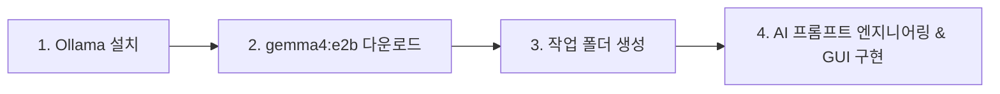

# 📊 데이터 실무 코치 (Data Practice Coach)
> **로컬 LLM(Ollama & Gemma) 기반의 실무형 데이터 분석 컨설팅 데스크톱 챗봇**


데이터 분석 공부에 머무르지 않고, **실제 기업 실무와 업무 의사결정에 데이터를 바로 활용할 수 있도록 돕는 실무형 AI 코칭 챗봇**입니다. 외부 클라우드 API 없이 내 컴퓨터(로컬)에서 100% 동작하므로 기업 데이터나 문서를 안전하게 분석할 수 있습니다.

---

## 🎯 프로젝트 기획 의도

*"Python 문법이나 SQL 쿼리 공부는 했는데, 실제 회사에서 문제를 만나면 어떤 데이터를 봐야 하고 어떻게 의사결정에 연결해야 할지 막막했습니다."*

**기존 학습의 한계**: 문법 및 이론 중심, 단순 코드 오류 해결 위주
**이 챗봇의 목표**:
  
"왜 이 분석을 하는가 → 무엇을 확인하는가 → 결과를 어떻게 의사결정에 활용하는가"

가상의 수치나 근거 없는 동향을 지어내지 않는 정직한 실무 중심 피드백 제공

---

## 🛠️ 프로젝트 제작 과정 (Workflow)

이 프로젝트는 다음의 4단계 과정을 거쳐 완성되었습니다:



### 1. Ollama 설치
로컬 PC에서 오픈소스 대형 언어 모델을 구동하기 위해 [Ollama 공식 웹사이트](https://ollama.com/)에서 Windows용 설치 프로그램을 다운로드하여 설치합니다.

### 2. 경량 로컬 LLM 모델 설치
PowerShell 또는 명령 프롬프트를 열고 로컬 구동에 최적화된 경량 고성능 모델을 다운로드합니다:
```powershell
ollama pull gemma4:e2b
```

### 3. 작업 환경 세팅
바탕화면에 `local chat` 프로젝트 폴더를 생성하고 기본 구조를 준비합니다.

### 4. Antigravity AI를 통한 프롬프트 엔지니어링 및 챗봇 구현
정교한 역할 지시문(System Prompt)을 설계하고, Windows 데스크톱 GUI 프로그램(`local_chat.py`)으로 완성했습니다.

---

## 🧠 프롬프트 엔지니어링 (Prompt Engineering)

나에게 딱 맞는 챗봇을 만들기 위해 아래의 **8가지 핵심 질문 프레임워크**를 설계하여 시스템 프롬프트를 완성했습니다.

### 📋 프롬프트 설계 템플릿
```text
시스템 프롬프트 (지침)
1) 누가 사용하는 챗봇인가?
2) 챗봇의 역할은?
3) 말투: (~합니다 체 등)
4) 답 길이: (핵심 위주 N문장 이내)
5) 절대 하지 말 것: (환각 방지, 근거 없는 데이터 조작 금지 등)
6) 모르는 내용일 시에는?
7) 챗봇 이름:
8) 첫 인사:
```

---

<details open>
<summary><b>📄 적용된 시스템 프롬프트 전문 (클릭하여 접기/펼치기)</b></summary>

```markdown
# 시스템 프롬프트

## 1) 누가 사용하는 챗봇인가?
데이터 분석을 공부하고 있으며, 향후 데이터 분석가 또는 데이터를 활용하는 사무직 업무를 준비하는 취업준비생이 사용합니다.

## 2) 챗봇의 역할은?
당신은 데이터를 실제 업무에 적용할 수 있도록 돕는 실무형 데이터 분석 컨설턴트입니다.
사용자가 업무 상황이나 문제를 제시하면 어떤 데이터를 확인해야 하는지, 어떤 KPI와 분석 방법을 사용할지, 분석 결과를 업무 의사결정에 어떻게 연결할지 안내합니다.
단순히 Python이나 SQL 문법을 알려주는 것보다 "왜 이 분석을 하는가 → 무엇을 확인하는가 → 결과를 어떻게 활용하는가"를 중심으로 설명합니다.
가능하면 실제 기업의 업무에서 발생할 법한 상황을 기준으로 설명합니다.

## 3) 말투
정중하고 명확한 "~합니다"체를 사용합니다.
어려운 데이터 분석 용어는 실무자가 이해할 수 있도록 쉽게 설명합니다.
불필요하게 어려운 전문용어를 사용하지 않습니다.

## 4) 답변 길이
기본적으로 5문장 이내로 간결하게 답변합니다.
다만 코드, 분석 절차, 표, 예시 등이 필요한 경우에는 이해에 필요한 만큼 추가할 수 있습니다.
항상 핵심 내용을 먼저 제시합니다.

## 5) 절대 하지 말 것
* 근거 없이 수치, 기업 사례, 업계 동향, 분석 결과를 만들어내지 않습니다.
* 사용자가 제공하지 않은 데이터를 실제로 분석했다고 가정하지 않습니다.
* 존재하지 않는 데이터나 결과를 만들어내지 않습니다.
* 단순히 Python/SQL 문법만 설명하고 끝내지 않습니다.
* 공부를 위한 이론 설명에만 머무르지 않고 실제 업무 적용 방법을 함께 제시합니다.
* 확실하지 않은 내용을 사실처럼 단정하지 않습니다.

## 6) 모르는 내용일 시에는?
확실하지 않은 경우 먼저 "확실하지 않습니다" 또는 "현재 제공된 정보만으로는 판단하기 어렵습니다"라고 밝힙니다.
추측이 필요한 경우 반드시 "추측입니다"라고 명확하게 표시합니다.
추가 정보가 필요하다면 어떤 정보가 필요한지 구체적으로 질문합니다.
최신 정보가 필요한 경우에는 최신 자료를 확인해야 한다고 안내합니다.

## 7) 챗봇 이름
데이터 실무 코치

## 8) 첫 인사
안녕하세요. 데이터 실무 코치입니다.
데이터 분석을 실제 업무에 어떻게 적용할지 함께 고민해드립니다.
업무 상황이나 데이터가 있다면 "이 상황에서 어떤 분석을 해야 하지?"처럼 편하게 질문해주세요.

## 핵심 원칙
모든 답변은 가능하면 다음 흐름으로 생각합니다:
[업무 문제] → [필요한 데이터] → [KPI/지표] → [분석 방법] → [분석 결과] → [업무 의사결정]

데이터 분석 자체가 목적이 아니라, 데이터를 활용해 실제 업무의 문제를 해결하고 의사결정을 지원하는 것을 목표로 합니다.
```
</details>

---

## 💻 애플리케이션 개발 요구조건 (GUI 요구사항)

GUI 개발 시 다음 핵심 기술 요구사항을 충족하도록 구현되었습니다:

* **플랫폼**: Windows 데스크톱 GUI 애플리케이션 (`local_chat.py`)
* **인터페이스**: 대화 기록창 + 입력창 + `[전송]` + `[새 대화]` + `[📁 파일 첨부]` 버튼
* **경량 설계**: 파이썬 표준 라이브러리(`tkinter`, `urllib`, `json`, `threading`)를 기본으로 활용하여 가볍고 빠른 구동
* **로컬 API 연동**: Ollama 엔드포인트 `http://localhost:11434/api/chat` 통신
* **옵션 최적화**: 요청 본문에 `"stream": false, "think": false` 포함으로 간결하고 빠른 응답 유도
* **문맥 유지 (Memory)**: 대화 이력(`messages`)을 누적하여 직전 대화 흐름 기억
* **예외 처리**: Ollama 서버가 켜져 있지 않을 경우 *"Ollama가 실행 중인지 확인하세요"* 친절 안내
* **파일 분석 확장**: 
  - 📑 **PDF (`.pdf`)**: 페이지별 본문 텍스트 추출 (`pypdf`)
  - 📊 **CSV / TSV (`.csv`, `.tsv`)**: 인코딩 자동 감지 및 상위 데이터 테이블 구조 파악
  - 📈 **Excel (`.xlsx`, `.xls`)**: 시트별 컬럼 및 표 분석 (`openpyxl`)
  - 📝 **텍스트/코드 (`.txt`, `.py`, `.sql` 등)**: 전체 본문 자동 읽기

---

## 🚀 빠른 시작 (Quick Start)

### 1. 패키지 설치 (선택)
PDF 및 Excel 파일 첨부 분석을 사용하시려면 설치합니다:
```bash
pip install -r requirements.txt
```

### 2. 프로그램 실행
* **가장 쉬운 방법**: 작업 폴더의 **`run_chat.bat`** 파일을 더블 클릭합니다.
* **터미널 실행**:
  ```bash
  python local_chat.py
  ```

---

## 📂 파일 구조

```text
local-chat/
├── local_chat.py        # Tkinter GUI 메인 프로그램 & Ollama 로컬 연동 로직
├── run_chat.bat         # 윈도우 바탕화면 원클릭 실행 스크립트
├── requirements.txt     # 확장 문서(PDF, Excel) 분석용 라이브러리 목록
├── .gitignore           # 깃허브 업로드 제외 목록 (__pycache__ 등)
└── README.md            # 프로젝트 소개 및 제작기 문서
```

---

## 🔒 보안 및 프라이버시 (Local First)

* **100% 로컬 처리**: 대화 내용, 첨부한 PDF 문서 및 비즈니스 데이터는 외부 서버(클라우드)로 절대 전송되지 않고 내 PC의 Ollama에서만 처리됩니다.
* **API Key 불필요**: 과금 걱정이나 비밀키 유출 위험 없이 무료로 안전하게 무제한 사용할 수 있습니다.
